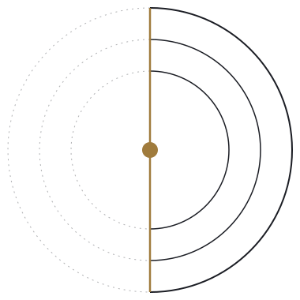
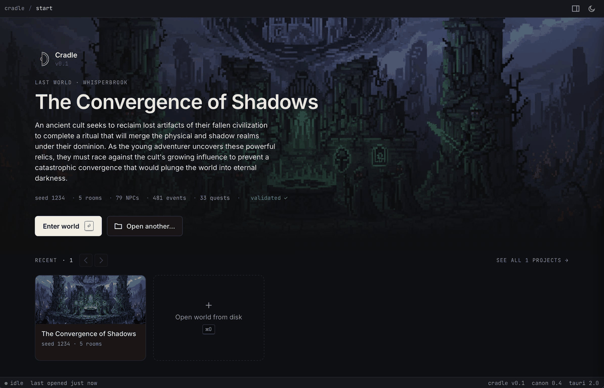

<p align="center">
  
</p>

# Cradle

> The agentic atelier for game development.

By **Demi** ([github.com/Demi-Build](https://github.com/Demi-Build)) — agentic atelier for game developers.

[](https://github.com/Demi-Build/cradle/actions/workflows/ci.yml)
[](LICENSE)



Cradle reads worlds emitted by [canon](https://github.com/Demi-Build/canon-ai) (early development; public release coming soon) and renders them as a structured, navigable inspector. canon is a Python library that brings coherence tooling to AI-generated game content — generating a World Bible, 3-stage validation pipeline, retry-with-feedback. Cradle lets you walk that output without running the game, adding a taste-making layer for game developers, storytellers, and world builders.

The reference world is **MazeWorld**, an AI-orchestrated 2D RPG where every NPC, item, quest, portrait, music cue, and SFX is generated from a single `STORY_SEED` via a skeleton-driven pattern. Cradle's primary test target is a MazeWorld-generated world — in the coming weeks this will be replaced with canon-generated worlds and eventually the ability to develop within cradle and plug into various game engines.

## Download

Pre-built binaries live on the [Releases page](https://github.com/Demi-Build/cradle/releases/latest). v0.1 ships:

- **macOS (universal: Intel + Apple Silicon)** — `.dmg`, signed with a Developer ID and notarized by Apple. Double-click to install, no Gatekeeper bypass needed.
- **Windows (.msi)** — unsigned for v0.1; SmartScreen will warn on first run ("More info" → "Run anyway"). Code signing lands in v0.1.x.
- **Linux (.AppImage)** — unsigned, which is the norm for AppImages. `chmod +x` and run.

To run from source on any platform, see [Development](#development) below.

## Cradle Use Case

If you're an **indie developer** evaluating AI-content tooling, cradle lets you inspect the artifact before you commit to a content protocol. Open a world, click through every NPC, walk the dialogue graph, see how a generation actually hangs together end-to-end — without booting an engine.

If you're a **researcher** working on coherence in generative game content, cradle is a structured viewer for the primitives canon emits: World Bible, four-tree NPC dialogue with quest gates, validation reports, generation stats. The data layer is a single Rust trait (`DataSource`) so the viewer can sit on top of any source you can implement — filesystem today, server or blob store tomorrow.

## Development Goals

AI-generated game content needs a coherence protocol. canon defines it; cradle is the first tool built on it. Together these two surfaces will keep developing: live LLM dialogue against loaded NPCs, a data surface for fast iteration, and simulation adapters for environments, NPC AI, agentic-game testing, and game-engine co-development. v0.1 is the read-only core — see the [roadmap](#roadmap) at the bottom for the milestones in between.

## Privacy

Cradle is currently for local development and consumes finished worlds emitted by canon. No telemetry, no network calls, no analytics — every world you load stays on your machine.

## Status: v0.1

v0.1 is a static inspector. Editing lands in v0.2, live dialogue in v0.3, simulation adapters in v0.4+.

Cradle is local-first and makes no network calls at runtime — see [PRIVACY.md](./PRIVACY.md).

**Shipped:**

- **Start screen** — atmospheric returning-user hero with last-world summary + recent project rail, or a first-run onboarding card if no history. Persisted to `localStorage` as `cradle.recents.v1`.
- **Recent projects page** — sortable/filterable grid + list views of every world opened, grouped by time (Today / Yesterday / Earlier this week / …).
- **Three-pane world shell** — title-bar breadcrumb + notes drawer + theme toggle; left nav with category subgroups (items by category, events by type) and clickable world-title as the Bible link; central detail pane with tabs.
- **Per-type detail views** — each entity type has a tailored Overview:
  - **NPCs:** big portrait + story/quest badges, stats grid next to portrait, backstory, hobby/personality/greeting/exhausted/portrait-prompt prose, personality-notes bullets, shop-inventory table, combat-form block (for `AggressiveNPC` types with `npc_monster` stats).
  - **Monsters:** D&D-style HP / AC / Damage stat block, element chips, abilities grid with weapon-card dice readouts.
  - **Rooms:** two-image hero (entry portrait + maze map), layout metadata, bible-beat story section, placed NPCs / items / events / quests as clickable lists.
  - **Items:** per-category stats table (weapon, food, drink, tool, spell-scroll) next to portrait.
  - **Events / Puzzles:** event stats; choices render in a dedicated Puzzle tab with Card + Graph modes, failure damage surfaced on the prompt.
  - **Classes:** portrait + starting weapon with looked-up attack dice + 4+3 stats grid + ability/spell pool cards with "starting" badges.
  - **Quests:** contract card — title + chips, description, Links (giver · in room · prereq), Objective (type-driven: escort / solve / combat / fetch), Contract (success xp/item vs failure hp), success/failure dialogue with "open in npc dialogue →" jump.
- **Dialogue system** — four trees per NPC (default · complete · incomplete · failed) woven into a single state machine with a Quest-gate node separating conversation branching from quest-state branching. Card mode (driver buttons between beats) and Graph mode (React Flow with dagre auto-layout, colored edges per beat kind).
- **Cross-linking** — any `giver_npc_id`, `room_id`, `monster_ids[]`, `item_id`, `prerequisite_quest_id`, `destination_room`, `target_event_id`, `target_npc_id`, etc. renders as a clickable pill that selects the referenced entity.
- **Lightbox** — click any portrait, map, or hero image to view full-screen; `portrait_prompt` is the hover tooltip on every image.
- **Design system** — token-based dark + light themes (Inter + JetBrains Mono, warm-neutral palette, oklch accent amber). Arc-style overlay scrollbars (hidden at rest, fade in on pane hover). Float layout for NPC/monster/event/class/quest so text wraps around the portrait.
- **Notes drawer** — slides in from the right; Changelog content editable at `src/components/start/NotesDrawer.tsx`.

**Still pending (blocked on canon emissions):**

- Validation bar wiring — needs `validation_report.json`.
- Generation trail tab (prompts · responses · retry history) — needs `generation_log.jsonl`.
- Monster base attack dice — `MonsterStatBlock` reads `attack_dice` / `damage_dice` / `damage` at the monster root when canon emits any of them; currently all monster damage flows through the abilities array.

**Explicitly deferred to v0.2+ (not in v0.1 scope):**

- **Auto-updater.** Tauri ships one, but it depends on signed builds across every target. Wires up alongside Windows code signing.
- **Windows code signing.** v0.1 ships an unsigned `.msi` (SmartScreen warning on first run). A code-signing cert lands in v0.1.x; CI is already wired with `WINDOWS_CERTIFICATE` env-var TODOs.
- **Interactive mode.** Edit data live — change dialogue, flavor text, add characters, puzzles, and events.
- **Plugin / extension API.** Utilize Generative Model API endpoints as well as scaffold on-prem models for custom generation to extend / ideate within worlds.
- **Chat interface.** What's a modern dev tool without a friend?
- **Schema-typed canon dependency.** Lands in v0.2 once canon stabilizes its public schema.

## Keyboard navigation

Works anywhere (skipped while a text input is focused; `⌘` / `Ctrl` held releases control to the native shortcut).

| Key                        | Action                                                              |
| -------------------------- | ------------------------------------------------------------------- |
| `↑` / `↓`                  | Cycle within the current entity type's list                         |
| `↑` at first / `↓` at last | Spill into the adjacent type (last of prev / first of next)         |
| `⌥↑` / `⌥↓`                | Skip-jump to previous / next type's first entity                    |
| `←`                        | From an entity, step up to the type view (cards/list)               |
| `→`                        | From a type view, step down into the first entity                   |
| `Tab` / `⇧Tab`             | Cycle tabs inside the detail pane (Overview → Dialogue → Raw, etc.) |
| `Esc`                      | Close the notes drawer / dismiss the lightbox                       |

(Why `⌥↑/↓` and not `⌘↑/↓`: `⌘↑/↓` is reserved by macOS for "go to parent folder" and "scroll to top/bottom of document". `⌥↑/↓` mirrors Slack and Discord's "jump between sidebar groups" convention.)

## Data layer

Cradle talks to a `DataSource` trait in `src-tauri/src/data.rs`. v0.1 ships one impl, `LocalFsDataSource`, which reads from a local world directory. A future `RemoteDataSource` (for a collaborative/server-hosted mode) can slot in behind the same trait without frontend changes — all IPC goes through typed wrappers in `src/lib/invoke.ts`.

Expected world layout (matches MazeWorld's output):

```
<world>/
  data/
    world_bible.json
    manifest.json
    narrative.json
    generation_stats.json
    npcs/npcs.json
    items/items.json
    monsters/monsters.json
    quests/quests.json
    events/events.json
    classes/classes.json
    classes/spell_pools.json
    rooms/<room_id>/maze.json
    portraits/
      npcs/npc_<id>.png
      monsters/mon_<name>.png
      items/item_<slug>.png
      events/evt_<id>.png
      classes/class_<idx>.png
      maps/room_<idx>_map.png
      environment_<idx>.png
      start_screen.png
    music/*.mp3
    sfx/*.mp3
```

Reference world ships in `bibles/mazeworld_5_room_demo/`.

The Tauri asset protocol resolves absolute portrait paths emitted by canon (including ones that point at MazeWorld's install path) by stripping the `data/portraits/…` prefix and re-rooting under the loaded world.

## Stack

- **Tauri 2** (Rust backend, native webview) — cross-platform; macOS and Windows bundles via `npm run tauri build`.
- **React 19 + TypeScript + Vite** frontend.
- **zustand v5** — store (selection / world / recents / theme / drawer / lightbox).
- **TanStack Table** — sortable filterable entity list view.
- **@xyflow/react** + **@dagrejs/dagre** — dialogue / puzzle graph views.
- **@tauri-apps/plugin-dialog** — native folder picker on the start screen.
- **Inter + JetBrains Mono** bundled locally via [@fontsource-variable](https://fontsource.org/) — no runtime CDN call.
- No runtime dependency on canon — cradle reads canon's already-validated JSON output. Schema typing lands in v0.2 once canon stabilizes.

## Development

### Prerequisites

- Node 20+
- Rust toolchain (install via [rustup](https://rustup.rs))
- Platform build deps for Tauri — see the [Tauri prerequisites](https://tauri.app/start/prerequisites/) page for your OS

### Setup

```
npm install
npm run fetch-demo
```

`npm run fetch-demo` downloads the bundled MazeWorld 5-room demo (~1 GB, mostly portraits) from the [`demo-v0.1.0` GitHub Release](https://github.com/Demi-Build/cradle/releases/tag/demo-v0.1.0) into `bibles/mazeworld_5_room_demo/`. It's a separate step (not a `postinstall` hook) so first-time `npm install` doesn't surprise you with a 1 GB download. The script is idempotent — re-running is a no-op once the demo is in place.

### Run

```
npm run tauri dev
```

On first launch you'll see the first-run card. Click **Open world from disk** to pick a directory (native folder picker), or **Try the bundled demo** to load the world fetched in the setup step above. After that, the start screen's returning-user hero shows your last world and a recent-projects rail.

### Build

```
npm run tauri build
```

Produces a platform-native bundle in `src-tauri/target/release/bundle/` — `.dmg` / `.app` on macOS, `.msi` / `.exe` on Windows.

### Type-check / Rust-check

```
npx tsc --noEmit
cd src-tauri && cargo check
```

## Layout

```
cradle/
  src/
    App.tsx                              keyboard nav + routing
    store.ts                             zustand store
    main.tsx                             tokens.css + start.css imports
    lib/
      invoke.ts                          typed Tauri commands
      recents.ts                         RecentProject type + localStorage
      refs.ts                            cross-link field map + id normalizer
    styles/
      tokens.css                         design tokens + scrollbars
      start.css                          start / recents page styles
    components/
      TopBar.tsx  LeftNav.tsx  DetailPane.tsx  ValidationBar.tsx
      Tabs.tsx  Portrait.tsx  EntityLink.tsx  Lightbox.tsx
      EntityTable.tsx  EntityOverview.tsx  WorldBibleView.tsx
      ExpandableText.tsx  ErrorBoundary.tsx  AudioPlayer.tsx
      start/      StartScreen · StartTitleBar · StartStatusBar
                  ReturningHero · RecentsRail · RecentTile
                  FirstRunCard · NotesDrawer · BrandMark · Icons · useAssetUrl
      recents/    RecentProjectsPage · RecentCard · RecentRow
      dialogue/   DialogueTab · DialogueCardMode · DialogueGraphMode · DialogueCard · types
      event/      PuzzleTab · PuzzleCardMode · PuzzleGraphMode · ChoiceCard · types
      quest/      QuestDetail
      room/       RoomContents · RoomStory
      monster/    MonsterStatBlock · MonsterAbilities
      class/      AbilityList (abilities + spells, starting vs pool)
  src-tauri/
    src/
      data.rs                            DataSource trait + LocalFsDataSource
      lib.rs                             Tauri commands
    tauri.conf.json                      assetProtocol scope, dialog plugin
    Cargo.toml
  bibles/                                reference fixture worlds
```

## Roadmap

- **v0.2** — editing, regeneration, canon schema types as a dependency; VS Code-style nav (activity bar + collapsible sidebar + breadcrumb trail); validation bar wiring once canon emits it; generation trail tab.
- **v0.2.5** — live LLM dialogue against loaded NPCs.
- **v0.3** — simulation adapters (combat, environment) via pluggable backends.
- **v0.4** — game engine implementation across open source game engines.
- **Later** — collaborative mode (`RemoteDataSource`), multi-world diffing.
